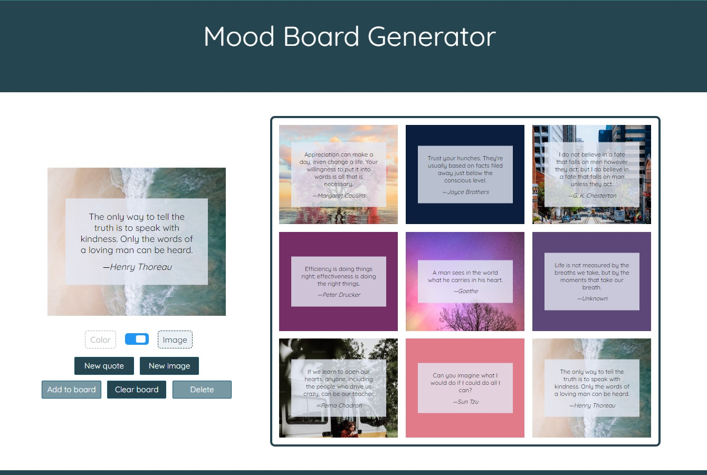

# Mood Board Generator

This is a React web app to create a mood board consisting of quotes by famous figures displayed over aesthetic images and colors. The quotes are provided by the [Type.fit API](https://type.fit/api/quotes), and the images are fetched from the [Unsplash API](https://unsplash.com/developers).

## Setup

This app requires an Unsplash API access key, which is hidden in an untracked `.env` file at the root of the project and then retrieved on the server side with Netlify functions. The `.env` file contains the following:

    ACCESS_KEY=your_access_key_here;

From the Mood-Board-Generator directory, run these commands to install the Node dependencies and launch the app:

    npm install
    netlify dev

## Features

- A new random quote can be requested until a desired one is found.
- A quote can have an image or a solid color as a backdrop. The user selects which type of background to generate for each quote.
- A new random image or color can be requested until a desired one is found.
- A mood board consists of multiple quotes displayed in a grid.
- The currently selected quote and backdrop combination, called a card, can be added to the mood board.
- A mood board can have up to nine cards, in a 3x3 grid.
- A quote card can be selected by clicking on it, which will highlight the card.
- A selected card can be removed from the mood board by clicking the Delete button.
- Quote cards can be drag-and-dropped within the mood board to change their order.
- The mood board can be downloaded as an image file.